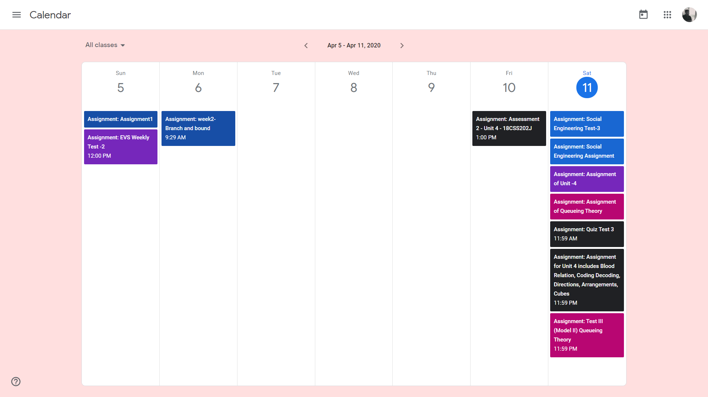
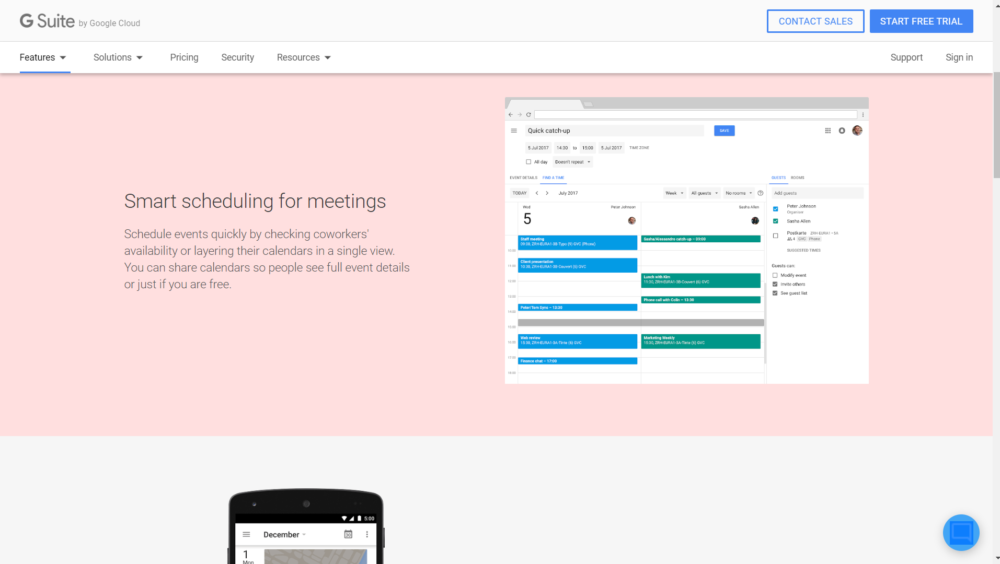

  

<h1 align="center">
  Weatherly- A React App
</h1>

  
  
  

Allows the user to Change Background color of LinkedIn, StackOverflow and Google Products.

### About Contributing

* use github Desktop **RECOMMENDED** ..
* **Fork** the Repository and star it 😁👏👏👏 😜😜.
* git clone https://github.com/Uyadav207/Pimo.git  
* Type `code .` for [VsCode](https://code.visualstudio.com/) 
  * `atom .` for [Atom](https://atom.io/)
* Update `content.js` for any javascript manipulations.
* Save everything.
* `git checkout -b **<name-your-branch>** origin/**<name-of-remote-branch>**` for Checkout all changes ... 
* now push eveything Up....
* Raise a merge-Request.. ✔✔✔

# Download Pimo 

* Checkout the Link : [PIMO:Chrome-Extension](https://chrome.google.com/webstore/detail/pimo/gcigjkpkbodoajlpcgjmplhodcjmdbfc?utm_source=gmail) 

# After Downloading Appeareance 💖💖❤ ✔✔✔
* Check your status bar, if it seems like this then U did a great Job else retry ... Or Raise an issue or bug.

# ScreenShots AfterEffects 👏👏👏

💖💖❤✔
# ThankYou for Downloading...💖

